# Project overview

## Situation:

Crown EduTech is an organisation that provides technical online learning for users around the world. They have a learning management system (LMS) that is currently hosted on-premises. Since they are expecting growth and more users in their Platform in future, they wanted to move to a cloud solution that provides scalability, security and performance. The DevOps engineers at Crown EduTech have decided to migrate from on-premises to a containerized AWS application.

## Solution:

A containerized LMS frontend on AWS ECS Fargate with monitoring capabilities. This project demonstrates how AWS container services work together and explore basic troubleshooting skills for common misconfigurations.

## Steps to be performed:

The project contains the following steps:

* Setting up the AWS environment for containerized applications
* Container image preparation for the LMS frontend
* Deploying the LMS frontend on ECS Fargate
* Comprehensive troubleshooting of container issues in ECS
* Resolving ALB configuration issues
* Correcting security group misconfigurations

## Services Used
* Amazon ECS with Fargate: Serverless compute engine for containers
* Application Load Balancer (ALB): Routes HTTP/HTTPS traffic to containers
* Amazon CloudWatch: Monitoring and observability for logs and metrics
* AWS IAM: Identity and access management for AWS resources
* Amazon ECR: Container registry for managing and deploying images
* AWS Security Groups: Virtual firewalls controlling network traffic

# Actions performed:

## Setup of AWS environment

1. Created a dedicated VPC for hosting our containerised application in Amazon ECS with the following options:
    * `Name`: EduTech-VPC
    * `Availability Zones`: 2
    * `Number of public subnets`: 2
    * `Number of private subnet`s: 0 (simplified for this implementation)
    * `NAT Gateways`: None (cost optimization)
    * `VPC Endpoints`: None

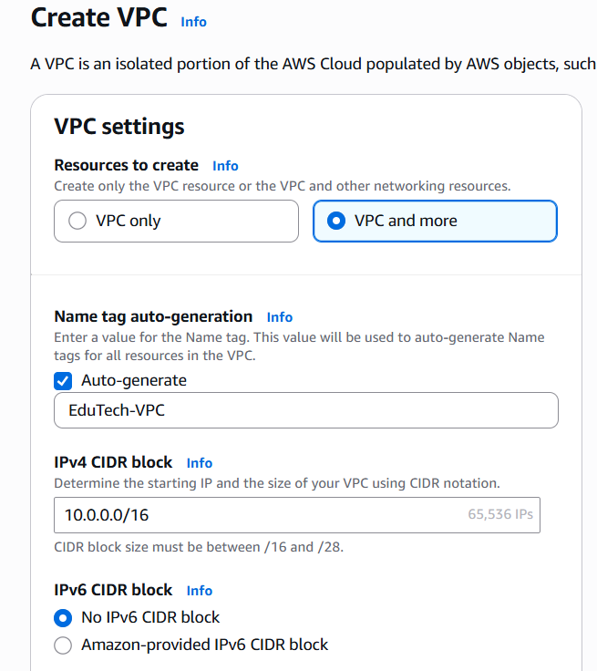
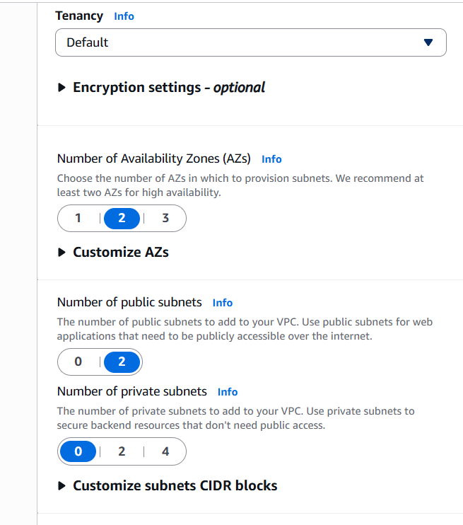
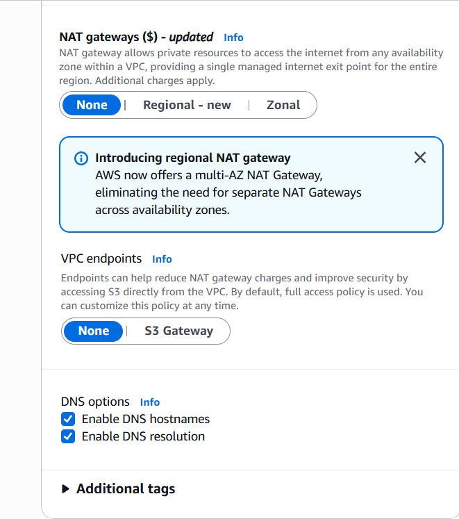

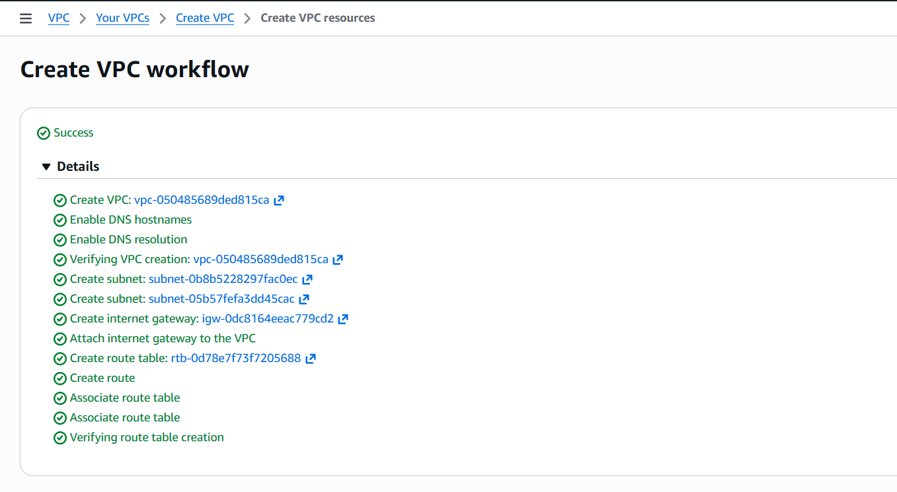

2. Created the following security groups for Application Load Balancer (ALB) and container with relevant inbound and outbound rules
    * `EduTech-ALB-SG`
    * `EduTech-Container-SG`

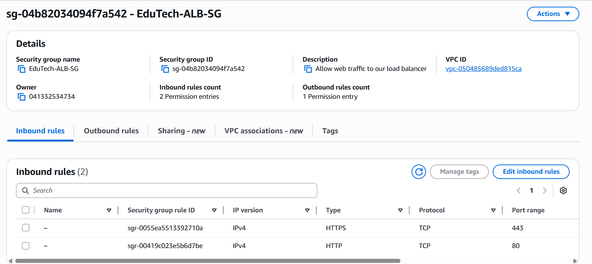
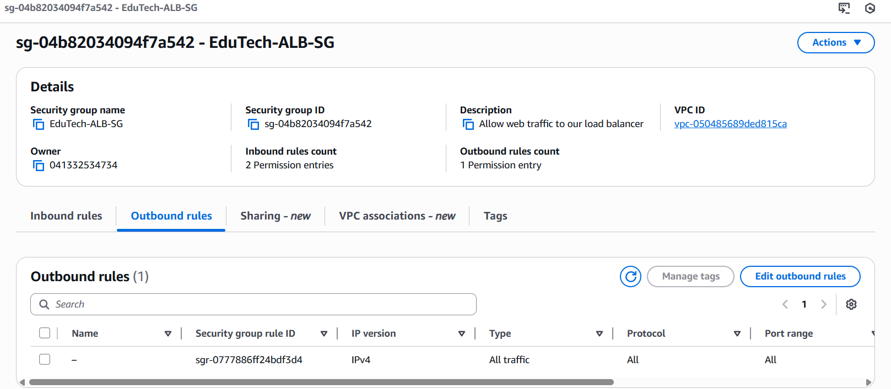

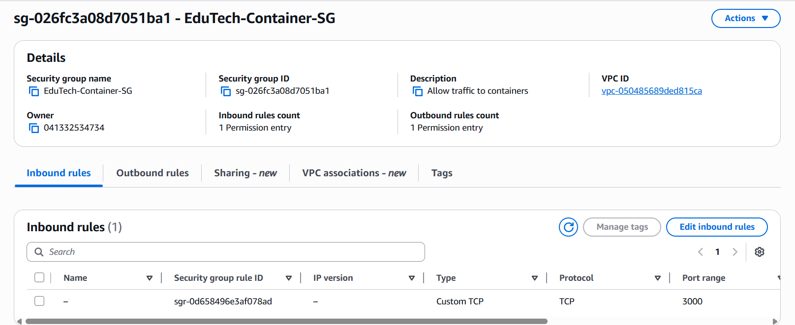

3. Created the required IAM roles for ECS service and task execution
    * `EduTech-ECS-Service-Role`
    * `EduTech-ECS-Task-Role`

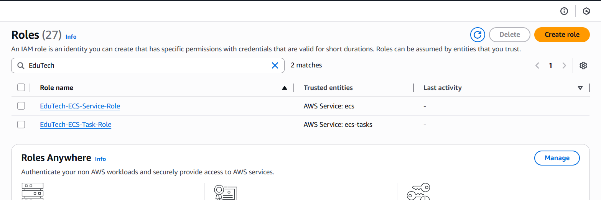
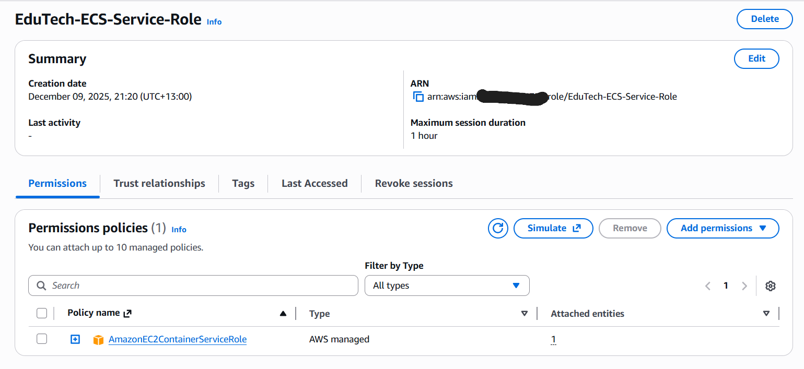
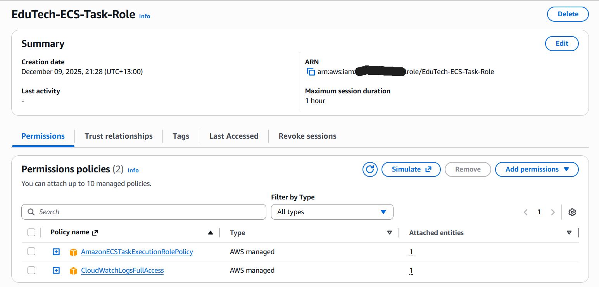

## Containerisation of LMS frontend application

1. The application code is available in this repository under https://github.com/jobyjfrancis/aws-projects/tree/main/containerized-LMS-migration/edutech-project/frontend

2. Created the required `Dockerfile` for the application to containerise it - https://github.com/jobyjfrancis/aws-projects/blob/main/containerized-LMS-migration/edutech-project/frontend/Dockerfile

3. Created a repository named `edutech-lms-frontend` in Amazon ECR (Elastic Container Registry)

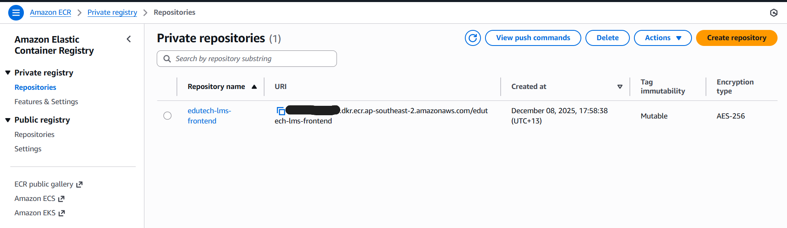

4. Checked the commands in the `View push commands` in Amazon ECR and executed them one by one to build the docker image for the LMS frontend application and push it to the ECR repository `edutech-lms-frontend`. 

#### Docker login to the Amazon ECR repository
```
joby@LAPTOP-KVPR8SO6:~/learn/aws-projects (main)$ aws ecr get-login-password --region ap-southeast-2 | docker login --username AWS --password-stdin 041332534734.dkr.ecr.ap-southeast-2.amazonaws.com
Login Succeeded
joby@LAPTOP-KVPR8SO6:~/learn/aws-projects (main)$
```
#### Build the docker image
```
joby@LAPTOP-KVPR8SO6:~/learn/aws-projects (main)$ cd containerized-LMS-migration/edutech-project/frontend/
joby@LAPTOP-KVPR8SO6:~/learn/aws-projects/containerized-LMS-migration/edutech-project/frontend (main)$ docker build -t edutech-lms-frontend .
[+] Building 12.9s (12/12) FINISHED                                                                                              docker:default
 => [internal] load build definition from Dockerfile                                                                                       0.0s
 => => transferring dockerfile: 465B                                                                                                       0.0s
 => [internal] load metadata for docker.io/library/node:16-alpine                                                                          1.8s
 => [internal] load .dockerignore                                                                                                          0.0s
 => => transferring context: 2B                                                                                                            0.0s
 => [1/7] FROM docker.io/library/node:16-alpine@sha256:a1f9d027912b58a7c75be7716c97cfbc6d3099f3a97ed84aa490be9dee20e787                    0.0s
 => => resolve docker.io/library/node:16-alpine@sha256:a1f9d027912b58a7c75be7716c97cfbc6d3099f3a97ed84aa490be9dee20e787                    0.0s
 => [internal] load build context                                                                                                          0.0s
 => => transferring context: 5.16kB                                                                                                        0.0s
 => CACHED [2/7] WORKDIR /app                                                                                                              0.0s
 => CACHED [3/7] COPY package*.json ./                                                                                                     0.0s
 => CACHED [4/7] RUN npm install                                                                                                           0.0s
 => CACHED [5/7] COPY . .                                                                                                                  0.0s
 => CACHED [6/7] RUN npm run build                                                                                                         0.0s
 => CACHED [7/7] RUN npm install -g serve                                                                                                  0.0s
 => exporting to image                                                                                                                    10.9s
 => => exporting layers                                                                                                                    0.0s
 => => exporting manifest sha256:3fc3f644b1156eb888d99998110f5a3a91b0b3aad0f3a39c942b63cae69a8b66                                          0.0s
 => => exporting config sha256:b1f2b3c68878c427aa786dd5796dbd5326423c6e3de343703389da5f19e644a8                                            0.0s
 => => exporting attestation manifest sha256:ea9f5a9a9337cbf22fa18bac5836ed779375aeb390fea4d729c7d5c7ca415293                              0.0s
 => => exporting manifest list sha256:7c86939d65a53e2c462593e4607352da9d18ee8506c73e04ca27c7943ca2a859                                     0.0s
 => => naming to docker.io/library/edutech-lms-frontend:latest                                                                             0.0s
 => => unpacking to docker.io/library/edutech-lms-frontend:latest                                                                         10.8s
joby@LAPTOP-KVPR8SO6:~/learn/aws-projects/containerized-LMS-migration/edutech-project/frontend (main)$
```
```
joby@LAPTOP-KVPR8SO6:~/learn/aws-projects/containerized-LMS-migration/edutech-project/frontend (main)$ docker images
REPOSITORY             TAG       IMAGE ID       CREATED      SIZE
edutech-lms-frontend   latest    7c86939d65a5   4 days ago   1.28GB
joby@LAPTOP-KVPR8SO6:~/learn/aws-projects/containerized-LMS-migration/edutech-project/frontend (main)$
```
#### Tag the docker image appropriately so that it can be pushed to Amazon ECR 
```
joby@LAPTOP-KVPR8SO6:~/learn/aws-projects/containerized-LMS-migration/edutech-project/frontend (main)$ docker tag edutech-lms-frontend:latest 041332534734.dkr.ecr.ap-southeast-2.amazonaws.com/edutech-lms-frontend:latest
joby@LAPTOP-KVPR8SO6:~/learn/aws-projects/containerized-LMS-migration/edutech-project/frontend (main)$
joby@LAPTOP-KVPR8SO6:~/learn/aws-projects/containerized-LMS-migration/edutech-project/frontend (main)$
```
```
joby@LAPTOP-KVPR8SO6:~/learn/aws-projects/containerized-LMS-migration/edutech-project/frontend (main)$ docker images
REPOSITORY                                                               TAG       IMAGE ID       CREATED      SIZE
041332534734.dkr.ecr.ap-southeast-2.amazonaws.com/edutech-lms-frontend   latest    7c86939d65a5   4 days ago   1.28GB
edutech-lms-frontend                                                     latest    7c86939d65a5   4 days ago   1.28GB
joby@LAPTOP-KVPR8SO6:~/learn/aws-projects/containerized-LMS-migration/edutech-project/frontend (main)$
```
#### Push the docker image to ECR repository
```
joby@LAPTOP-KVPR8SO6:~/learn/aws-projects/containerized-LMS-migration/edutech-project/frontend (main)$ docker push 041332534734.dkr.ecr.ap-southeast-2.amazonaws.com/edutech-lms-frontend:latest
The push refers to repository [041332534734.dkr.ecr.ap-southeast-2.amazonaws.com/edutech-lms-frontend]
eee371b9ce3f: Layer already exists
a0dbbb7f946b: Layer already exists
14a72bc6a89c: Layer already exists
929675baf485: Layer already exists
d743060c8c6f: Layer already exists
7264a8db6415: Layer already exists
60f5c5ad5935: Layer already exists
39f048e446a7: Layer already exists
322b195c9484: Pushed
d9059661ce70: Layer already exists
93b3025fe103: Layer already exists
latest: digest: sha256:7c86939d65a53e2c462593e4607352da9d18ee8506c73e04ca27c7943ca2a859 size: 856
joby@LAPTOP-KVPR8SO6:~/learn/aws-projects/containerized-LMS-migration/edutech-project/frontend (main)$
```
5. Checked the ECR repository console and confirmed that the image has been uploaded

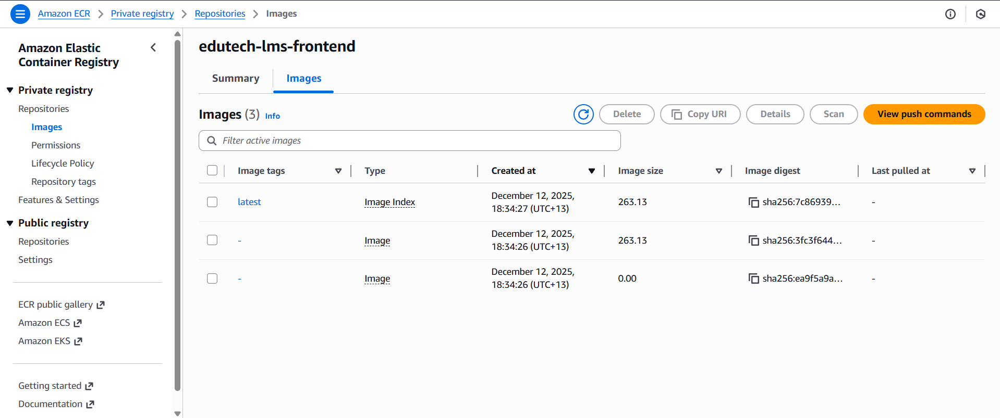

## Deployment of the LMS Frontend on ECS Fargate

1. Created an `ECS` cluster with `Fargate` as the infrastructure option - ` Using Fargate eliminates the need to provision and manage servers, making the deployment fully serverless and reducing operational overhead.`

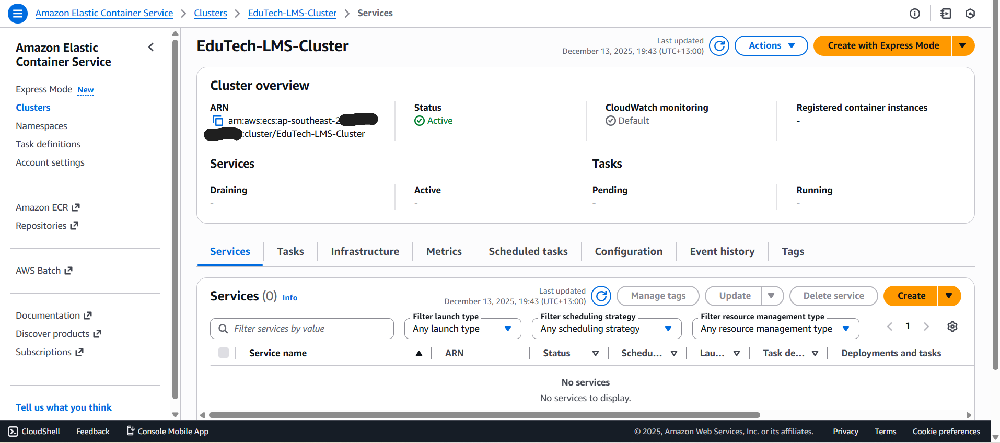

2. Created a `Task definition` with the following parameters - this defines the container execution parameters and resource requirements

    * Task definition family: EduTech-LMS-Task
    * Infrastructure requirements:
        * Launch type: AWS Fargate
        * Operating system/Architecture: Linux/X86_64
        * CPU: 0.5 vCPU
        * Memory: 1 GB
        * Task role: EduTech-ECS-Task-Role
        * Task execution role: EduTech-ECS-Task-Role
    * Container - 1
        * Name: lms-frontend
        * Image URI: 0*************4.dkr.ecr.ap-southeast-2.amazonaws.com/edutech-lms-frontend (as obtained from ECR registry)
        * Container Port: 3000
        * Protocol: TCP
        * CPU: 0.25
        * Memory hard limit: 0.5

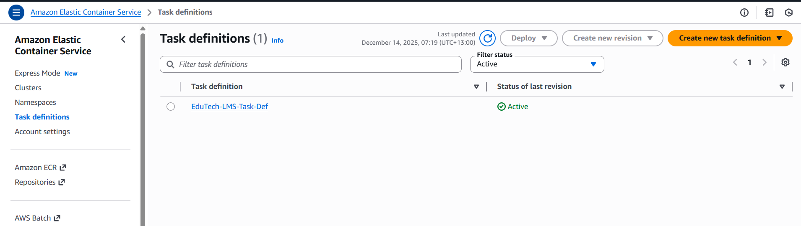 

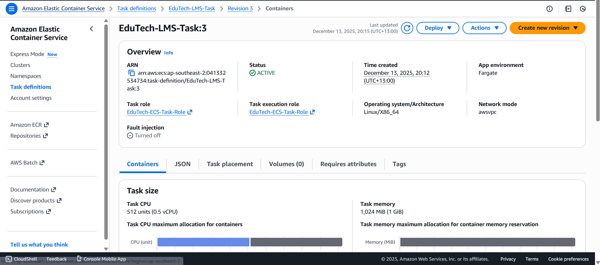


