# Project overview

## Situation:

GlobalMart, a leading e-commerce retailer with 300+ employees across 3 regions, has implemented a CI/CD pipeline for their product catalog service, but is experiencing deployment failures and site outages. With an estimated $25,000 in lost revenue per hour of downtime, they urgently need help troubleshooting their pipeline issues. As their Cloud Engineer, I'll identify and resolve the misconfiguration problems causing these failures.

## Solution:

A fully automated CI/CD pipeline using AWS CodePipeline and CodeDeploy with comprehensive monitoring capabilities. This project demonstrates how AWS DevOps services work together and teaches essential troubleshooting skills for common CI/CD misconfigurations.

## Steps to be performed:

The project contains the following steps:

* Architecture diagram
* Setting Up Your Environment: Prepare EC2 and GitHub repository
* Configuring AWS Services: Set up IAM roles and deployment tools
* Building Your CI/CD Pipeline: Configure CodeDeploy and CodePipeline

## Services Used
* AWS CodePipeline: Fully managed continuous delivery service
* AWS CodeDeploy: Deployment service for EC2 instances
* Amazon EC2: Compute instances for hosting the e-commerce application
* AWS IAM: Identity and access management for AWS resources
* GitHub: Source code repository with webhook integration
* Amazon S3: Storage for deployment artifacts
* AWS Security Groups: Virtual firewalls controlling network traffic

# Actions performed:

## Architecture diagram

[to do]

## Setup of EC2 environment and configuration

1. Setup an EC2 instance with the following parameters:

* Name: GlobalMart-WebServer
* AMI: <latest Amazon Linux 2>
* Instance type: t3.micro
* Key pair: demo-key-pair [already existing key pair in AWS account]
* Network settings:
    * VPC: default
    * Security Group: new SG with following inbound rules
        * Allow 80 (http) from 0.0.0.0/0
        * Allow 443 (https) from 0.0.0.0/0
        * Allow 22 (SSH) from own IP address
    * User data with the following configuration
    ```
    #!/bin/bash
    exec > /var/log/user-data.log 2>&1
    yum update -y

    # Install Node.js v16
    curl -sL https://rpm.nodesource.com/setup_16.x | bash -
    yum install -y nodejs

    # Install Nginx
    amazon-linux-extras install nginx1 -y
    systemctl start nginx
    systemctl enable nginx
    ```

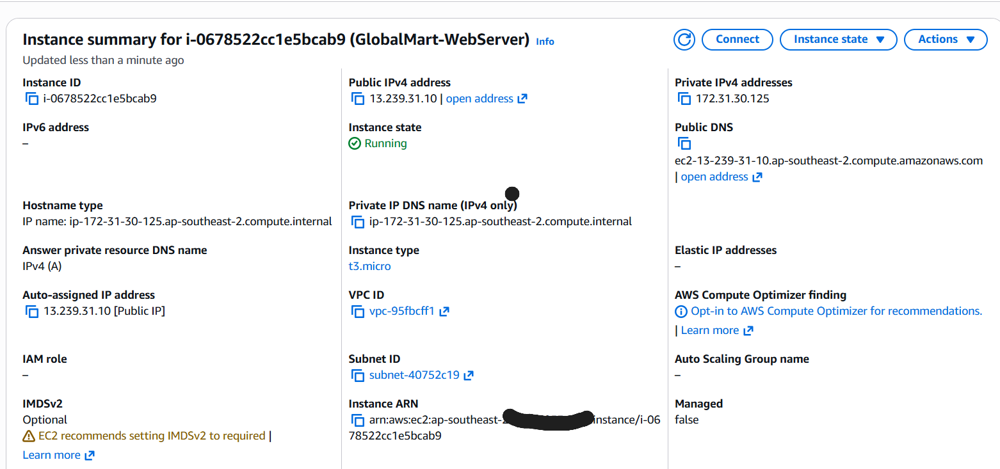

## Github repository configuration for the Globalmart application

1. The application repository for the GlobalMart application has been developed and hosted at https://github.com/jobyjfrancis/globalmart-catalog

2. The repository has also been configured with the configuration files required for `AWS CodeDeploy`
    * appspec.yml
    * scripts
        * before_install.sh
        * after_install.sh

## Setup of required IAM roles [Security]

1. Created the required IAM roles for EC2 and CodeDeploy
    * GlobalMart-EC2-Role
        * Trusted entity type: AWS service
        * Use case: EC2
        * Permissions:
            * AmazonS3ReadOnlyAccess
            * AmazonSSMManagedInstanceCore
            * AmazonEC2RoleforAWSCodeDeploy
        * Tags:
            * Key: Project, Value: GlobalMart
    
    This role with attached permissions allow the EC2 instance to perform the following:

    -> Access deployment artifacts from S3 buckets (S3ReadOnlyAccess)
    -> Be managed remotely via AWS Systems Manager (SSMManagedInstanceCore)
    -> Interact with CodeDeploy service to receive deployments (EC2RoleforAWSCodeDeploy)

    * GlobalMart-CodeDeploy-Role
        * Trusted entity type: AWS service
        * Use case: CodeDeploy
        * Permissions:
            * AWSCodeDeployRole
        * Tags:
            * Key: Project, Value: GlobalMart

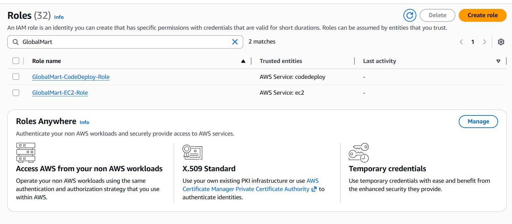

2. Attached the role `GlobalMart-EC2-Role` to the EC2 instance

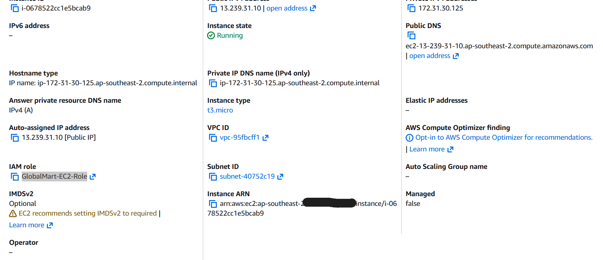

## Deployment: AWS CodeDeploy setup

1. Created the CodeDeploy application
    * Name: GlobalMart-Catalog
    * Compute platform: EC2/On-premises
    * Tags:
        * Key: Project, Value: GlobalMart

The EC2/On-premises compute platform is selected because we're deploying to an EC2 instance. CodeDeploy supports multiple deployment targets (including Lambda and ECS), but for traditional web applications hosted on virtual machines, EC2/On-premises is the appropriate choice.

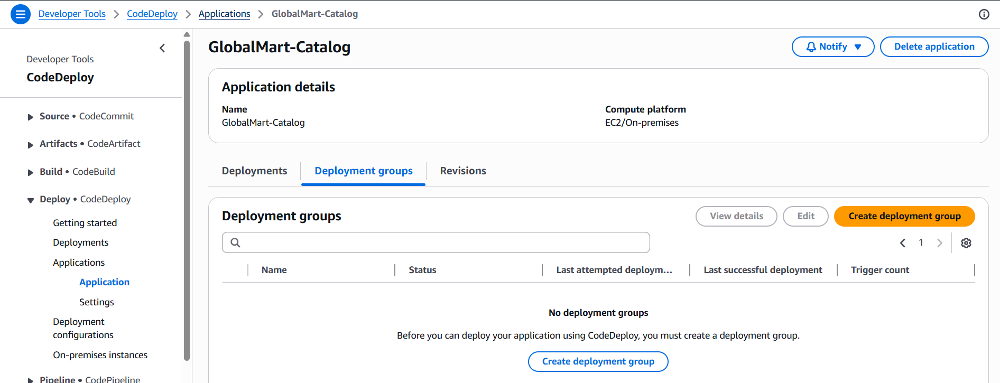

2. Created the Deployment Group
    * Name: `GlobalMart-Production`
    * Service role: `GlobalMart-CodeDeploy-Role`
    * Deployment type: In-place
    * Environment configuration: Amazon EC2 instances
    * Tag group:
        * Key: Name, Value: GlobalMart-WebServer
    * Install AWS CodeDeploy Agent: Now and schedule updates
    * Deployment settings: CodeDeployDefault.OneAtATime

This deployment configuration updates instances sequentially rather than all at once, which is a safer approach that minimizes risk. Even though we currently have only one instance, using this setting prepares your pipeline for scaling to multiple instances in the future.

    * Load balancer: Uncheck "Enable load balancing"

For a single-instance deployment, load balancing isn't necessary. Load balancers are used to distribute traffic across multiple instances, which would be important in a production environment with multiple servers

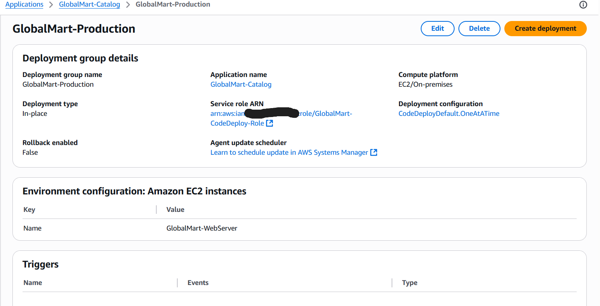
        
## Pipeline: AWS CodePipeline setup

1. Created the AWS CodePipeline with the following settings:
    * Option: Build custom pipeline
    * Pipeline settings:
        * Name: GlobalMart-Pipeline
        * Execution mode: Queued
        * Service role: Create new
    * Source Stage
        * Provider: GitHub (via OAuth app)
        * Click "Connect to GitHub"
        * Authorize AWS access
        * Repository: select "globalmart-catalog" repository
        * Branch: main
    * Build Stage
        * Build provider: Select "Commands"
        * Specify shell commands:
        ```
        npm install
        npm run build
        ```
        * Environment variables: None required
        * VPC ID: blank
        * Input artifacts: SourceArtifact (default)
    * Test Stage: Skip
    * Deploy Stage
        * Provider: AWS CodeDeploy
        * Region: Asia Pacific(Sydney)
        * Application name: `GlobalMart-Catalog`
        * Deployment group: `GlobalMart-Production`
    * Review and create the Pipeline

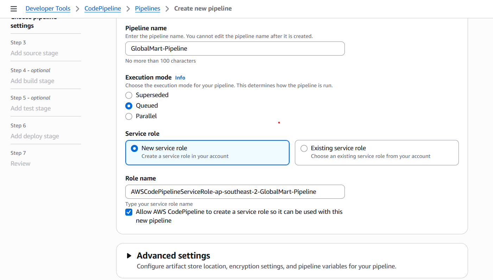
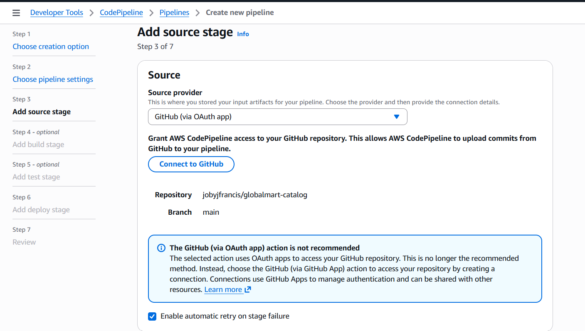
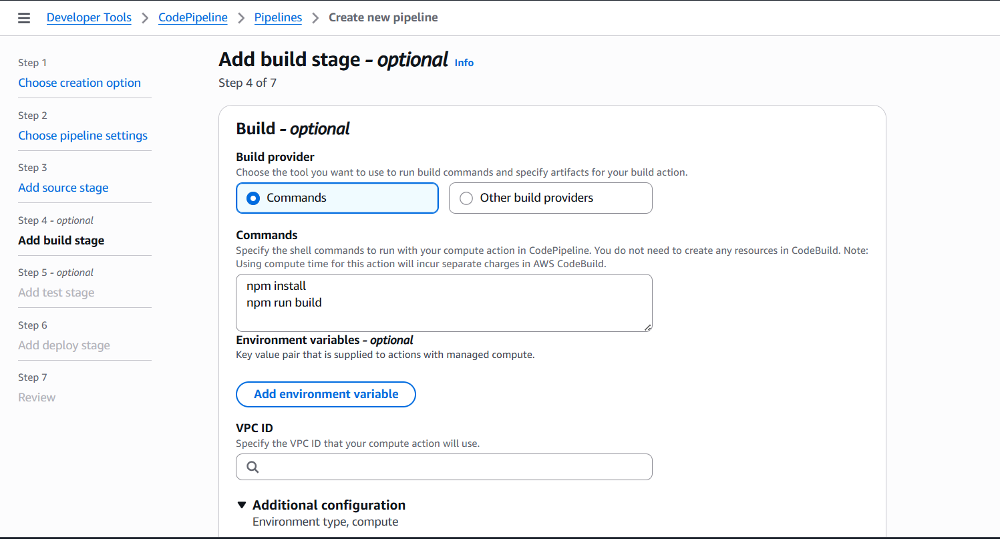
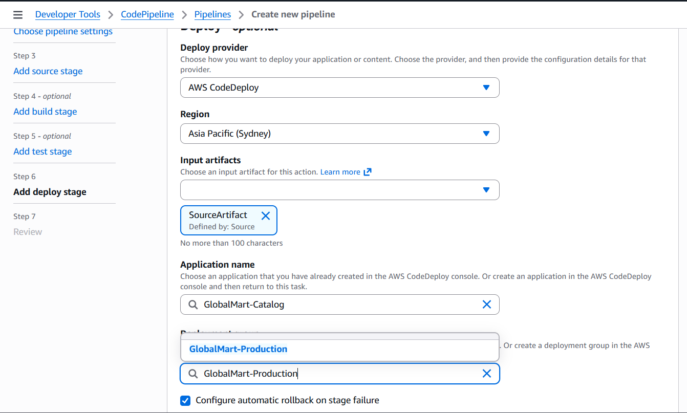

2. After the Pipeline creation, it would automatically start the Pipeline and execute all the stages
    * the first pipeline run would fail in the deploy stage as it cannot find the `build` folder from the source artifact
    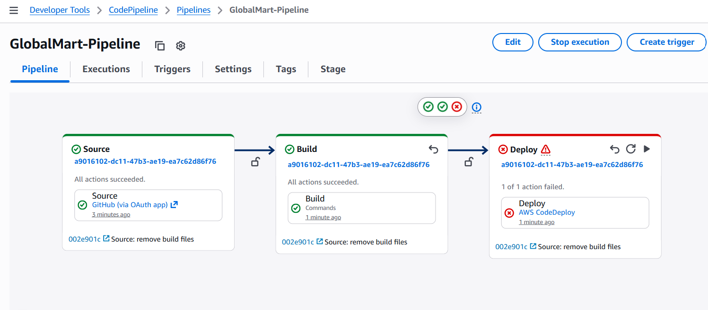
    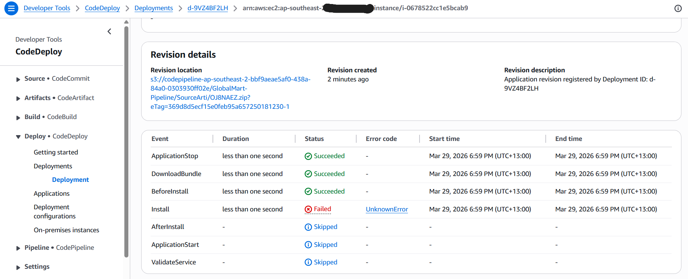
    * Fix it by editing the CodePipeline `build` stage and add the output artifact
        * Name: build-artifact
        * Files
            * build/**/*
            * scripts/*
            * appspec.yml
    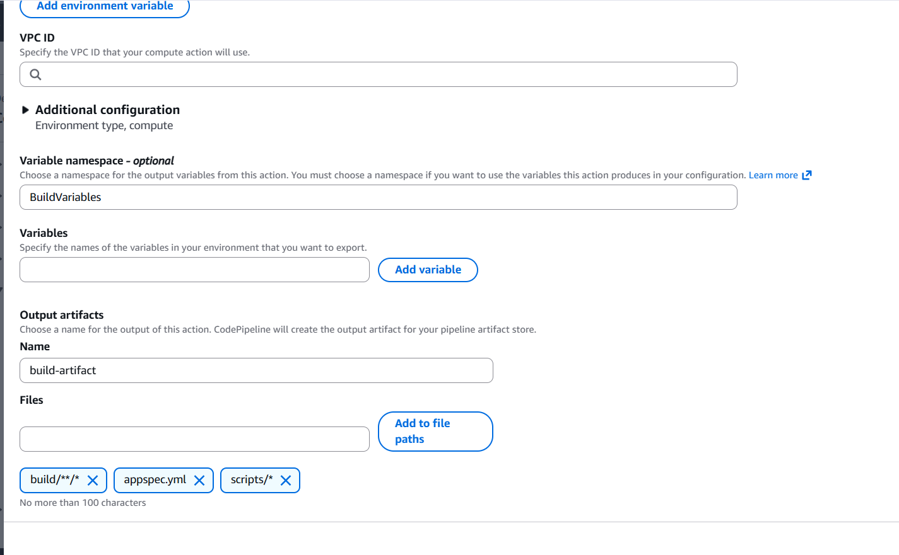
    * Also update the `deploy` stage to use Input artifacts to `build-artifact`
    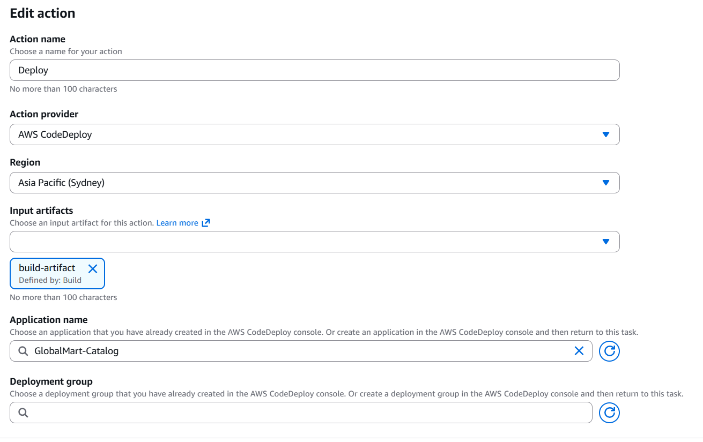 
    * Save the Pipeline settings and then `Release change`
    * Confirm that the Pipeline executed successfully
    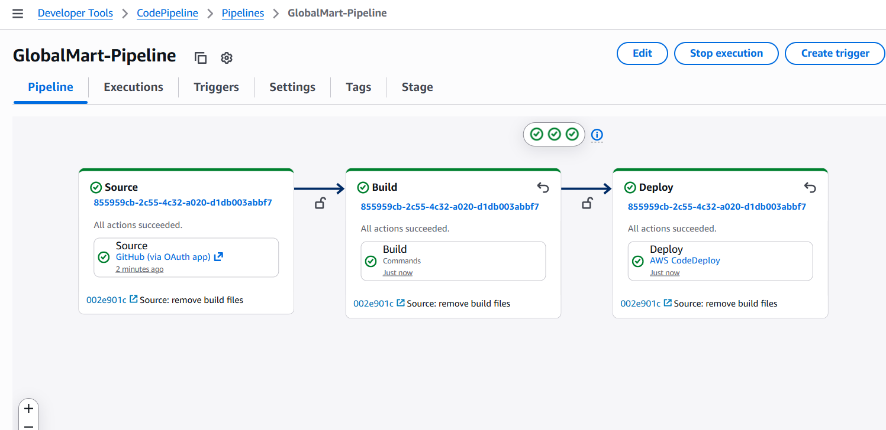

3. Once the Pipeline finishes execution, access the website using the public IP address of the EC2 instance

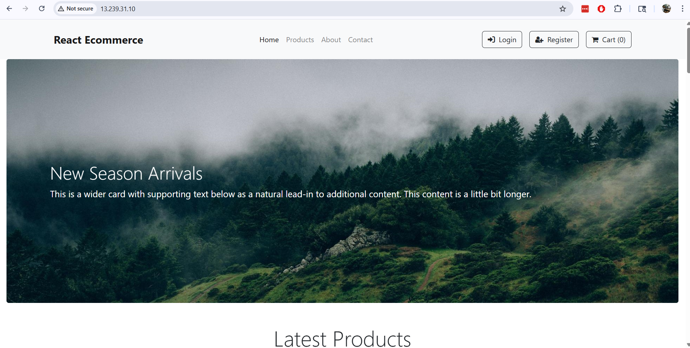


