# Project overview

## Situation:

CloudGuard, a financial services company, recently experienced a security breach because their operations team didn't detect unusual system behavior until it was too late. The incident resulted in significant downtime and potential data exposure. Management has prioritized implementing proactive monitoring and automated remediation to prevent similar incidents.

## Solution:

A comprehensive monitoring and auto-remediation system using AWS CloudWatch, Lambda, and GuardDuty that automatically detects and responds to performance issues and security threats across development and production environments.

## Steps to be performed:

The project contains the following steps:

* Architecture diagram
* Configure EC2 Environments (Dev and Prod)
* Implement Custom CloudWatch Monitoring
* Create Automated Remediation with Lambda
* Enable GuardDuty and Security Incident Response

## Services Used:

* Amazon EC2: Virtual servers to simulate development and production environments
* Amazon CloudWatch: Monitoring service for metrics, alarms, and automated responses
* AWS Lambda: Serverless compute service for running auto-remediation code
* AWS GuardDuty: Intelligent threat detection service
* AWS IAM: Identity and Access Management service for controlling permissions

# Actions performed:

## Architecture diagram

[To-Do]

## Setup of EC2 instances for Dev and Prod environments

1. Created two EC2 instances with the following parameters:

EC2 instance 1 (Dev):
--------------------
* Name: dev-server
* Additonal tag: Key: Environment, Value: Development
* Amazon Machine Image (AMI): Amazon Linux 2023
* Instance type: t3.micro
* Key pair: <SSH key pair>
* Network settings: Allow SSH traffic from your IP
    -> Create security group: 
        -> Rule: SSH from My IP
* Configure storage: Default (8 GB gp3)

EC2 instance 2 (Prod):
---------------------
* Name: prod-server
* Additonal tag: Key: Environment, Value: Production
* Amazon Machine Image (AMI): Amazon Linux 2023
* Instance type: t3.micro
* Key pair: <SSH key pair>
* Network settings: Allow SSH traffic from your IP
    -> Create security group: 
        -> Rule: SSH from My IP
* Configure storage: Default (8 GB gp3)

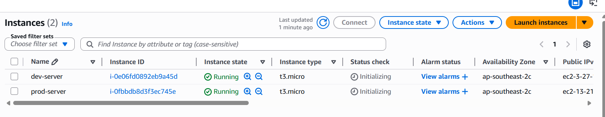

## Configuration of EC2 instances with tools

In this stage, we will configure both `dev` and `prod` ec2 instances with specific tools which can be used to simulate/generate real world performance issues.

The `dev` server will be installed with `stress` tool to generate CPU load and `prod` server will be installed with `util-linux` (to use `falloc`) to consume excessive disk space.

1. SSH into the `dev-server` instance and install `stress` tool as per below:

```
[ec2-user@ip-172-31-30-163 ~]$ sudo yum install stress -y
Amazon Linux 2023 Kernel Livepatch repository                                                                   265 kB/s |  31 kB     00:00
Dependencies resolved.
================================================================================================================================================
 Package                      Architecture                 Version                                      Repository                         Size
================================================================================================================================================
Installing:
 stress                       x86_64                       1.0.7-2.amzn2023.0.1                         amazonlinux                        34 k

Transaction Summary
================================================================================================================================================
Install  1 Package

Total download size: 34 k
Installed size: 68 k
Downloading Packages:
stress-1.0.7-2.amzn2023.0.1.x86_64.rpm                                                                          542 kB/s |  34 kB     00:00
------------------------------------------------------------------------------------------------------------------------------------------------
Total                                                                                                           335 kB/s |  34 kB     00:00
Running transaction check
Transaction check succeeded.
Running transaction test
Transaction test succeeded.
Running transaction
  Preparing        :                                                                                                                        1/1
  Installing       : stress-1.0.7-2.amzn2023.0.1.x86_64                                                                                     1/1
  Running scriptlet: stress-1.0.7-2.amzn2023.0.1.x86_64                                                                                     1/1
  Verifying        : stress-1.0.7-2.amzn2023.0.1.x86_64                                                                                     1/1

Installed:
  stress-1.0.7-2.amzn2023.0.1.x86_64

Complete!
[ec2-user@ip-172-31-30-163 ~]$
```

2. SSH into the `prod-server` instance and install `util-linux` tool. In some cases this tool would already exist as per seen below:

```
[ec2-user@ip-172-31-18-143 ~]$ sudo yum install util-linux -y
Amazon Linux 2023 Kernel Livepatch repository                                                                   247 kB/s |  31 kB     00:00
Package util-linux-2.37.4-1.amzn2023.0.4.x86_64 is already installed.
Dependencies resolved.
Nothing to do.
Complete!
[ec2-user@ip-172-31-18-143 ~]$
```

## Install CloudWatch agent for custom metrics

The default EC2 metrics available in CloudWatch are limited to basic system data like CPU utilization. By installing the CloudWatch agent, we can monitor critical metrics like memory usage, disk space, and detailed system performance data that are essential for comprehensive monitoring.

Dev instance
------------
1. SSH into the `dev-server` and install cloudwatch agent as per shown below:

```
[ec2-user@ip-172-31-30-163 ~]$ sudo yum install amazon-cloudwatch-agent -y
Last metadata expiration check: 0:04:18 ago on Fri May  1 21:40:17 2026.
Dependencies resolved.
================================================================================================================================================
 Package                                   Architecture             Version                                 Repository                     Size
================================================================================================================================================
Installing:
 amazon-cloudwatch-agent                   x86_64                   1.300064.2-1.amzn2023                   amazonlinux                    68 M

Transaction Summary
================================================================================================================================================
Install  1 Package

Total download size: 68 M
Installed size: 228 M
Downloading Packages:
amazon-cloudwatch-agent-1.300064.2-1.amzn2023.x86_64.rpm                                                         69 MB/s |  68 MB     00:00
------------------------------------------------------------------------------------------------------------------------------------------------
Total                                                                                                            66 MB/s |  68 MB     00:01
Running transaction check
Transaction check succeeded.
Running transaction test
Transaction test succeeded.
Running transaction
  Preparing        :                                                                                                                        1/1
  Running scriptlet: amazon-cloudwatch-agent-1.300064.2-1.amzn2023.x86_64                                                                   1/1
create group cwagent, result: 0
create user cwagent, result: 0

  Installing       : amazon-cloudwatch-agent-1.300064.2-1.amzn2023.x86_64                                                                   1/1
  Running scriptlet: amazon-cloudwatch-agent-1.300064.2-1.amzn2023.x86_64                                                                   1/1
  Verifying        : amazon-cloudwatch-agent-1.300064.2-1.amzn2023.x86_64                                                                   1/1

Installed:
  amazon-cloudwatch-agent-1.300064.2-1.amzn2023.x86_64

Complete!
[ec2-user@ip-172-31-30-163 ~]$
```
2. Create the amazon cloudwatch agent configuration file under `/opt/aws/amazon-cloudwatch-agent/etc/amazon-cloudwatch-agent-config.json` (use the configuration defined in the file `amazon-cloudwatch-agent-dev-config.json` in this repository)

```
[ec2-user@ip-172-31-30-163 ~]$ sudo nano /opt/aws/amazon-cloudwatch-agent/etc/amazon-cloudwatch-agent-config.json
[ec2-user@ip-172-31-30-163 ~]$
[ec2-user@ip-172-31-30-163 ~]$ head /opt/aws/amazon-cloudwatch-agent/etc/amazon-cloudwatch-agent-config.json
{
      "agent": {
        "metrics_collection_interval": 60
    },
    "metrics": {
        "append_dimensions": {
            "InstanceId": "${aws:InstanceId}",
            "InstanceType": "${aws:InstanceType}",
            "AutoScalingGroupName": "${aws:AutoScalingGroupName}",
            "ImageId": "${aws:ImageId}"
[ec2-user@ip-172-31-30-163 ~]$
```

3. Apply the configuration and restart the agent as per below:

```
[ec2-user@ip-172-31-30-163 ~]$ sudo /opt/aws/amazon-cloudwatch-agent/bin/amazon-cloudwatch-agent-ctl -a fetch-config -m ec2 -s -c file:/opt/aws/amazon-cloudwatch-agent/etc/amazon-cloudwatch-agent-config.json
****** processing amazon-cloudwatch-agent ******
Starting config-downloader, this will map back to a call to amazon-cloudwatch-agent
Executing /opt/aws/amazon-cloudwatch-agent/bin/amazon-cloudwatch-agent with arguments: [config-downloader -output-dir /opt/aws/amazon-cloudwatch-agent/etc/amazon-cloudwatch-agent.d -config /opt/aws/amazon-cloudwatch-agent/etc/common-config.toml -multi-config default -mode ec2 -download-source file:/opt/aws/amazon-cloudwatch-agent/etc/amazon-cloudwatch-agent-config.json]I! Trying to detect region from ec2
D! [EC2] Found active network interface
I! imds retry client will retry 1 times
Start configuration validation...
2026/05/01 21:48:43 Reading json config file path: /opt/aws/amazon-cloudwatch-agent/etc/amazon-cloudwatch-agent.d/file_amazon-cloudwatch-agent-config.json.tmp ...
2026/05/01 21:48:43 I! Valid Json input schema.
2026/05/01 21:48:43 D! ec2tagger processor required because append_dimensions is set
2026/05/01 21:48:43 D! delta processor required because metrics with diskio or net are set
2026/05/01 21:48:43 D! ec2tagger processor required because append_dimensions is set
2026/05/01 21:48:43 Configuration validation first phase succeeded
Starting config-translator, this will map back to a call to amazon-cloudwatch-agent
Executing /opt/aws/amazon-cloudwatch-agent/bin/amazon-cloudwatch-agent with arguments: [config-translator -input-dir /opt/aws/amazon-cloudwatch-agent/etc/amazon-cloudwatch-agent.d -output /opt/aws/amazon-cloudwatch-agent/etc/amazon-cloudwatch-agent.toml -mode ec2 -config /opt/aws/amazon-cloudwatch-agent/etc/common-config.toml -multi-config default -input /opt/aws/amazon-cloudwatch-agent/etc/amazon-cloudwatch-agent.json]I! Trying to detect region from ec2
D! [EC2] Found active network interface
I! imds retry client will retry 1 times
/opt/aws/amazon-cloudwatch-agent/bin/amazon-cloudwatch-agent -schematest -config /opt/aws/amazon-cloudwatch-agent/etc/amazon-cloudwatch-agent.toml
Configuration validation second phase succeeded
Configuration validation succeeded
amazon-cloudwatch-agent has already been stopped
Created symlink /etc/systemd/system/multi-user.target.wants/amazon-cloudwatch-agent.service → /etc/systemd/system/amazon-cloudwatch-agent.service.
[ec2-user@ip-172-31-30-163 ~]$
```
Prod instance
------------
1. SSH into the `prod-server` and install cloudwatch agent as per shown below:

```
[ec2-user@ip-172-31-18-143 ~]$ sudo yum install amazon-cloudwatch-agent -y
Last metadata expiration check: 0:23:52 ago on Fri May  1 21:42:08 2026.
Dependencies resolved.
================================================================================================================================================
 Package                                   Architecture             Version                                 Repository                     Size
================================================================================================================================================
Installing:
 amazon-cloudwatch-agent                   x86_64                   1.300064.2-1.amzn2023                   amazonlinux                    68 M

Transaction Summary
================================================================================================================================================
Install  1 Package

Total download size: 68 M
Installed size: 228 M
Downloading Packages:
amazon-cloudwatch-agent-1.300064.2-1.amzn2023.x86_64.rpm                                                         43 MB/s |  68 MB     00:01
------------------------------------------------------------------------------------------------------------------------------------------------
Total                                                                                                            42 MB/s |  68 MB     00:01
Running transaction check
Transaction check succeeded.
Running transaction test
Transaction test succeeded.
Running transaction
  Preparing        :                                                                                                                        1/1
  Running scriptlet: amazon-cloudwatch-agent-1.300064.2-1.amzn2023.x86_64                                                                   1/1
create group cwagent, result: 0
create user cwagent, result: 0

  Installing       : amazon-cloudwatch-agent-1.300064.2-1.amzn2023.x86_64                                                                   1/1
  Running scriptlet: amazon-cloudwatch-agent-1.300064.2-1.amzn2023.x86_64                                                                   1/1
  Verifying        : amazon-cloudwatch-agent-1.300064.2-1.amzn2023.x86_64                                                                   1/1

Installed:
  amazon-cloudwatch-agent-1.300064.2-1.amzn2023.x86_64

Complete!
[ec2-user@ip-172-31-18-143 ~]$
```

2. Create the amazon cloudwatch agent configuration file under `/opt/aws/amazon-cloudwatch-agent/etc/amazon-cloudwatch-agent-config.json` (use the confiuration defined in the file `amazon-cloudwatch-agent-prod-config.json` in this repository)

```
[ec2-user@ip-172-31-18-143 ~]$ sudo nano /opt/aws/amazon-cloudwatch-agent/etc/amazon-cloudwatch-agent-config.json
[ec2-user@ip-172-31-18-143 ~]$ head /opt/aws/amazon-cloudwatch-agent/etc/amazon-cloudwatch-agent-config.json
{
  "agent": {
    "metrics_collection_interval": 60
  },
  "metrics": {
    "namespace": "CWAgent",
    "metrics_collected": {
      "disk": {
        "resources": [
          "/"
[ec2-user@ip-172-31-18-143 ~]$
```

3. Apply the configuration and restart the agent as per below:

```
[ec2-user@ip-172-31-18-143 ~]$ sudo /opt/aws/amazon-cloudwatch-agent/bin/amazon-cloudwatch-agent-ctl -a fetch-config -m ec2 -s -c file:/opt/aws/amazon-cloudwatch-agent/etc/amazon-cloudwatch-agent-config.json
****** processing amazon-cloudwatch-agent ******
Starting config-downloader, this will map back to a call to amazon-cloudwatch-agent
Executing /opt/aws/amazon-cloudwatch-agent/bin/amazon-cloudwatch-agent with arguments: [config-downloader -output-dir /opt/aws/amazon-cloudwatch-agent/etc/amazon-cloudwatch-agent.d -config /opt/aws/amazon-cloudwatch-agent/etc/common-config.toml -multi-config default -mode ec2 -download-source file:/opt/aws/amazon-cloudwatch-agent/etc/amazon-cloudwatch-agent-config.json]I! Trying to detect region from ec2
D! [EC2] Found active network interface
I! imds retry client will retry 1 times
Start configuration validation...
2026/05/01 22:08:23 Reading json config file path: /opt/aws/amazon-cloudwatch-agent/etc/amazon-cloudwatch-agent.d/file_amazon-cloudwatch-agent-config.json.tmp ...
2026/05/01 22:08:23 I! Valid Json input schema.
2026/05/01 22:08:23 D! metric decorator required because measurement fields are set
2026/05/01 22:08:23 Configuration validation first phase succeeded
Starting config-translator, this will map back to a call to amazon-cloudwatch-agent
Executing /opt/aws/amazon-cloudwatch-agent/bin/amazon-cloudwatch-agent with arguments: [config-translator -input /opt/aws/amazon-cloudwatch-agent/etc/amazon-cloudwatch-agent.json -input-dir /opt/aws/amazon-cloudwatch-agent/etc/amazon-cloudwatch-agent.d -output /opt/aws/amazon-cloudwatch-agent/etc/amazon-cloudwatch-agent.toml -mode ec2 -config /opt/aws/amazon-cloudwatch-agent/etc/common-config.toml -multi-config default]I! Trying to detect region from ec2
D! [EC2] Found active network interface
I! imds retry client will retry 1 times
/opt/aws/amazon-cloudwatch-agent/bin/amazon-cloudwatch-agent -schematest -config /opt/aws/amazon-cloudwatch-agent/etc/amazon-cloudwatch-agent.toml
Configuration validation second phase succeeded
Configuration validation succeeded
amazon-cloudwatch-agent has already been stopped
Created symlink /etc/systemd/system/multi-user.target.wants/amazon-cloudwatch-agent.service → /etc/systemd/system/amazon-cloudwatch-agent.service.
[ec2-user@ip-172-31-18-143 ~]$
```

## Set Up CloudWatch Alarms and Lambda Auto-Response

### CloudWatch Alarms for EC2 Monitoring

Setup a High usage CPU alarm (Dev instance)
-------------------------------------------
1. Create an alarm under Cloudwatch -> Alarms with the following configuration:
    * Select metric -> EC2 -> Per-Instance Metrics
    * Search bar: "CPUUtilization"
    * Find the `Dev` instance in the list
    * Select `CPUUtilization` metric for your instance
    * Click on `Select metric`
    
    Configure the metrics:
    * Statistic: average
    * Period: 1 minute

    Conditions:
    * Threshold type: Static
    * Whenever CPUUtilization is: Greater than/equal to
    * Threshold value: 85

    Actions:
    * Alarm state trigger", select "In alarm"
    * Send a notification to the following SNS topic: Create new topic
    * Topic name: EC2_Alarms
    * Email endpoints: <your email address>
    * Click on `Create topic` ->  this would send an email with AWS verification link - confirm subscription to receive notifications

    Name and description:
    * Alarm name: DevInstance-HighCPU
    * Alarm description: Alerts when CPU usage exceeds 85% for 1 minute


Setup a High Disk usage alarm (Prod instance)
---------------------------------------------
Before setting up Cloudwatch alarm for disk space usage, we need to set the following:

* Appropriate IAM permissions for the EC2 instance so that `CWagent` can send logs

1. If we check the `Prod` instance cloudwatch logs, it would show the following which indicates lack of proper IAM permissions:

```
[ec2-user@ip-172-31-18-143 ~]$ cd /opt/aws/amazon-cloudwatch-agent/logs/
[ec2-user@ip-172-31-18-143 logs]$ ls -al
total 44
drwxr-xr-x. 2 root root    77 May  1 22:08 .
drwxr-xr-x. 7 root root   140 May  1 22:06 ..
-rw-r--r--. 1 root root 36952 May  1 22:28 amazon-cloudwatch-agent.log
-rw-r--r--. 1 root root   148 May  1 22:08 configuration-validation.log
[ec2-user@ip-172-31-18-143 logs]$
[ec2-user@ip-172-31-18-143 logs]$
[ec2-user@ip-172-31-18-143 logs]$
[ec2-user@ip-172-31-18-143 logs]$ tail -25 amazon-cloudwatch-agent.log
 </head>
 <body>
  <h1>404 - Not Found</h1>
 </body>
</html>

        status code: 404, request id:
2026-05-01T22:28:49Z E! cloudwatch: code: NoCredentialProviders, message: no valid providers in chain, original error: EnvAccessKeyNotFound: failed to find credentials in the environment.
caused by: SharedCredsLoad: failed to load profile, .
EC2RoleRequestError: no EC2 instance role found
caused by: EC2MetadataError: failed to make EC2Metadata request
<?xml version="1.0" encoding="iso-8859-1"?>
<!DOCTYPE html PUBLIC "-//W3C//DTD XHTML 1.0 Transitional//EN"
                 "http://www.w3.org/TR/xhtml1/DTD/xhtml1-transitional.dtd">
<html xmlns="http://www.w3.org/1999/xhtml" xml:lang="en" lang="en">
 <head>
  <title>404 - Not Found</title>
 </head>
 <body>
  <h1>404 - Not Found</h1>
 </body>
</html>

        status code: 404, request id:
2026-05-01T22:28:49Z W! cloudwatch: 19 retries, going to sleep 41394 ms before retrying.
[ec2-user@ip-172-31-18-143 logs]$
```

a) To fix the issue, create an appropriate IAM role as per below:

* IAM -> Roles -> Create Role
* Trusted entity type: AWS service
* Use case: EC2
* Permissions policy: `CloudWatchAgentServerPolicy` managed policy
* Role name: EC2CloudWatchAgentRole


b) Attach the new IAM role to the `Prod` EC2 instance

* "Actions" > "Security" > "Modify IAM Role" -> Select role `CloudWatchAgentServerPolicy` -> Update IAM role

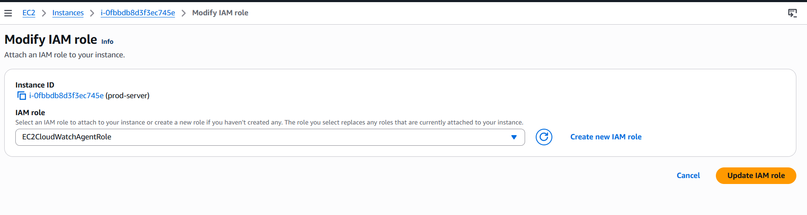

c) Restart `cloudwatch agent` in the Prod instance and check the logs again

```
[ec2-user@ip-172-31-18-143 logs]$ sudo systemctl restart amazon-cloudwatch-agent.service
[ec2-user@ip-172-31-18-143 logs]$
[ec2-user@ip-172-31-18-143 logs]$
[ec2-user@ip-172-31-18-143 logs]$
[ec2-user@ip-172-31-18-143 logs]$ tail -f amazon-cloudwatch-agent.log
2026-05-01T22:35:45Z I! {"caller":"service@v0.124.0/service.go:244","msg":"Skipped telemetry setup."}
2026-05-01T22:35:45Z I! {"caller":"service@v0.124.0/service.go:266","msg":"Starting CWAgent...","Version":"1.300064.2","NumCPU":2}
2026-05-01T22:35:45Z I! {"caller":"extensions/extensions.go:41","msg":"Starting extensions..."}
2026-05-01T22:35:45Z I! {"caller":"extensions/extensions.go:45","msg":"Extension is starting..."}
2026-05-01T22:35:45Z I! {"caller":"extensions/extensions.go:62","msg":"Extension started."}
2026-05-01T22:35:45Z I! {"caller":"extensions/extensions.go:45","msg":"Extension is starting..."}
2026-05-01T22:35:45Z I! {"caller":"extensions/extensions.go:62","msg":"Extension started."}
2026-05-01T22:35:45Z I! cloudwatch: get unique roll up list []
2026-05-01T22:35:45Z I! cloudwatch: publish with ForceFlushInterval: 1m0s, Publish Jitter: 6.531089651s
2026-05-01T22:35:45Z I! {"caller":"service@v0.124.0/service.go:289","msg":"Everything is ready. Begin running and processing data."}
```

2. Create an alarm under Cloudwatch -> Alarms with the following configuration:
    * Select metric -> CWAgent -> device, fstype, host, path
    * Search bar: "disk_used_percent"
    * Find the `Prod` instance in the list
    * Select `disk_used_percent` metric for your instance
    * Click on `Select metric`
    
    Configure the metrics:
    * Statistic: average
    * Period: 1 minute

    Conditions:
    * Threshold type: Static
    * Whenever disk_used_percent is: Greater than/equal to
    * Threshold value: 80

    Actions:
    * Alarm state trigger", select "In alarm"
    * Send a notification to the following SNS topic: `Select an existing SNS topic`
    * Topic name: EC2_Alarms
    
    Name and description:
    * Alarm name: ProdInstance-LowDisk
    * Alarm description: Alerts when disk usage exceeds 80% for 1 minute


### Setup Lambda for an automatic response

Here we setup a Lambda function which executes in response to the high CPU or disk usage alerts from Dev or Prod instance

1. Lambda console -> Create function -> Author from scratch
    * Function name: "EC2-AutoRemediation"
    * Runtime: "Python 3.10" 
    * Architecture: x86_64
    * Permissions -> Change default execution role: Create a new role with basic Lambda permissions
    * Click -> Create function 


2. After function creation, go to `configuration` tab
    * Permissions: click on `EC2-AutoRemediation-role-xxxx`
        * In the new IAM console -> attach policies
        * Search for `AmazonEC2ReadOnlyAccess` and attach it
    * Add permissions -> Inline policy -> JSON tab
    * Paste the following policy
            ```
            {
                "Version": "2012-10-17",
                "Statement": [
                    {
                    "Effect": "Allow",
                    "Action": "ec2:CreateTags",
                    "Resource": "arn:aws:ec2:*:*:instance/*"
                    }
                ]
            }
            ```
    * Click on Next -> Policy name `EC2TaggingPermissions` -> Create policy

    

    ```
    The above permissions are required by Lambda function to read EC2 instance information and add tags to track issues. We're following the principle of least privilege by only granting the specific permissions needed.
    ```
3. Return to Lambda function tab -> delete template code and paste the code in file `ec2-auto-remediation.py` -> deploy

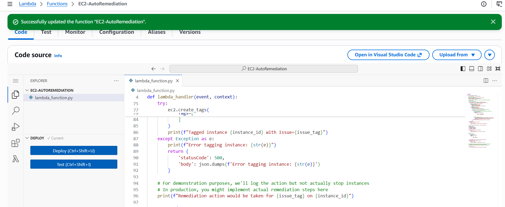

```
This Lambda function code receives alarm notifications from SNS, identifies the affected EC2 instance and issue type, and adds an "Issue" tag with the value "HighCPU" or "LowDisk". In a production environment, you could extend this to take automatic remediation actions like restarting services or scaling resources.
```
```
For simplicity, our Lambda function won't take any actual remediation action here, but instead add a tag to the respective EC2 instance based on the alert. In actual production environments we can take actions like restarting an EC2 instance, auto-scaling instances to manage the traffic etc.
```
### Connecting Lambda to SNS

1. Go to `SNS console -> Topics -> EC2_Alarm`

2. Create subscription
    * Protocol: AWS Lambda
    * Endpoint: EC2-AutoRemediation

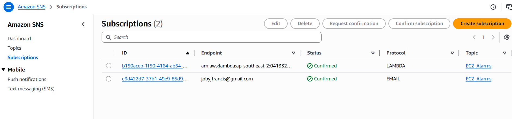

```
SNS acts as the messaging backbone, delivering CloudWatch alarm notifications to both human operators (via email) and automated systems (via Lambda). This helps ensure both automated and manual response can happen in parallel.
```

## Testing the monitoring system, alarms and responses

Here, we would introduce CPU performance issue in the `dev` server and disk space issue in the `prod` server using the tools we installed in these servers - `stress` and `falloc` and watch how Cloudwatch monitoring and alarms work. We would also check how the Lambda function respond to these alerts.

### Development Environment

1. SSH into the `dev` server and run the following command to generate CPU load

```
[ec2-user@ip-172-31-30-163 logs]$ sudo stress --cpu 8 --timeout 600
stress: info: [28306] dispatching hogs: 8 cpu, 0 io, 0 vm, 0 hdd
```
2. In AWS -> CloudWatch console -> Alarms, click on `DevInstance-HighCPU` and monitor the `CPUUtilization`. It should transition to `In Alarm` in a few minutes.

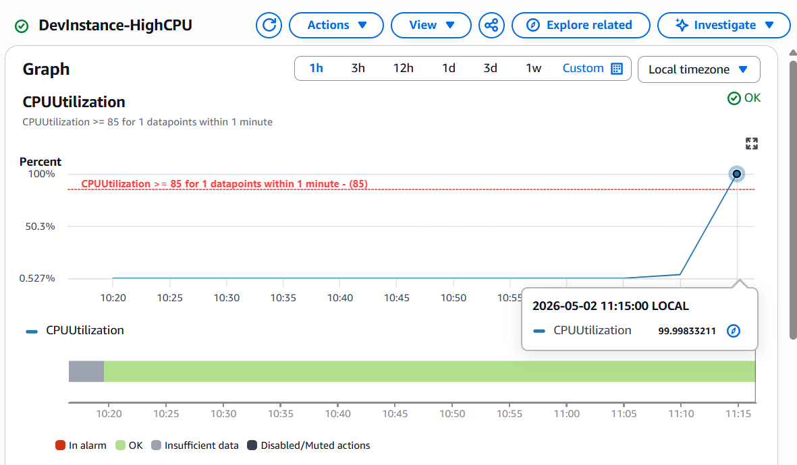

3. Once the alarm state is `In Alarm`, check your email for the AWS notification

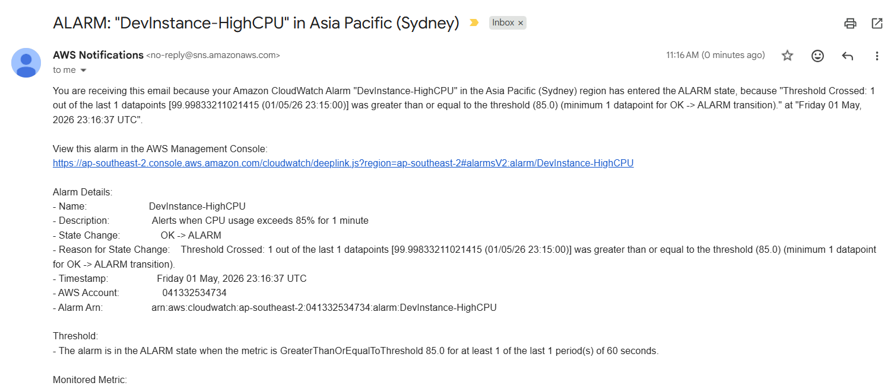

4. Check AWS Lambda -> ClouWatch logs for EC2-AutoRemediation function and it should show an invocation

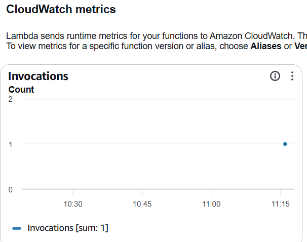

5. Go to the EC2 instance -> `dev-server` -> Tags and could confirm that tags have been created

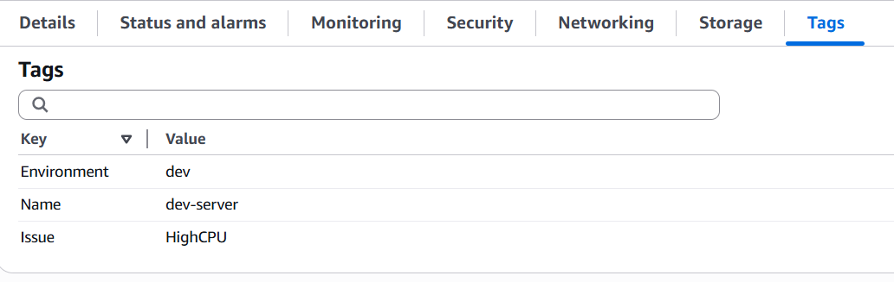

### Production Environment

1. SSH into the `prod` server and run the following command to increase disk usage

```
[ec2-user@ip-172-31-18-143 ~]$ sudo fallocate -l 6G /home/ec2-user/fakefile
[ec2-user@ip-172-31-18-143 ~]$ df -h /
Filesystem      Size  Used Avail Use% Mounted on
/dev/nvme0n1p1  8.0G  7.9G   85M  99% /
[ec2-user@ip-172-31-18-143 ~]$
```
```
This command creates a 6GB file, which on a standard t3.micro instance with an 8GB volume will push disk usage well above our 80% threshold.
```
2. In AWS -> CloudWatch console -> Alarms, click on `ProdInstance-LowDisk` and monitor the `disk_used_percent`. It should transition to `In Alarm` in a few minutes.

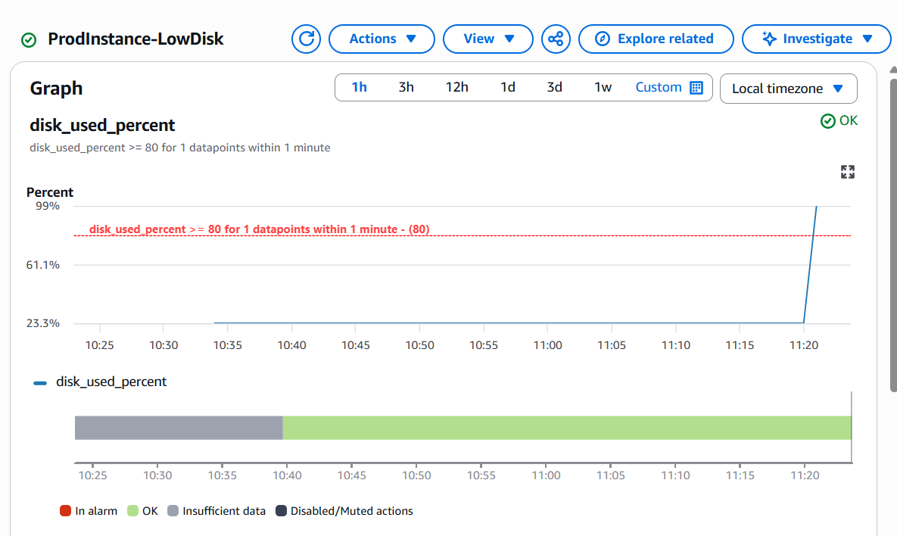

3. Once the alarm state is `In Alarm`, check your email for the AWS notification and Lambda function logs for function invocation

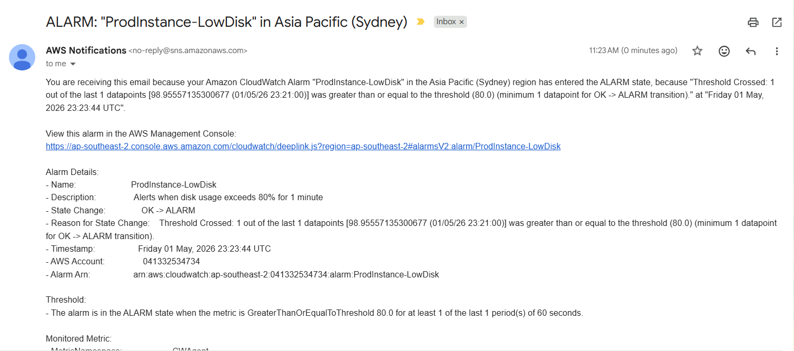

4. Go to the EC2 instance -> `prod-server` -> Tags and could confirm that tags have been created

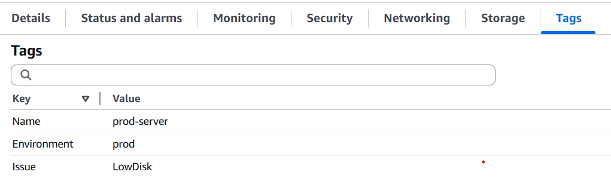

## Setting Up AWS GuardDuty and Simulating Security Threats for CloudGuard

1. Go to GuardDuty console -> Getting Started

2. Review the "Service role permissions" section

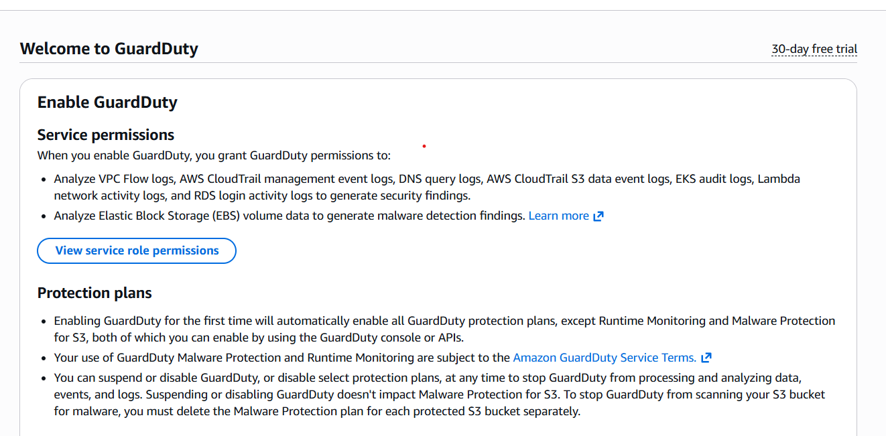

3. Click "Enable GuardDuty"

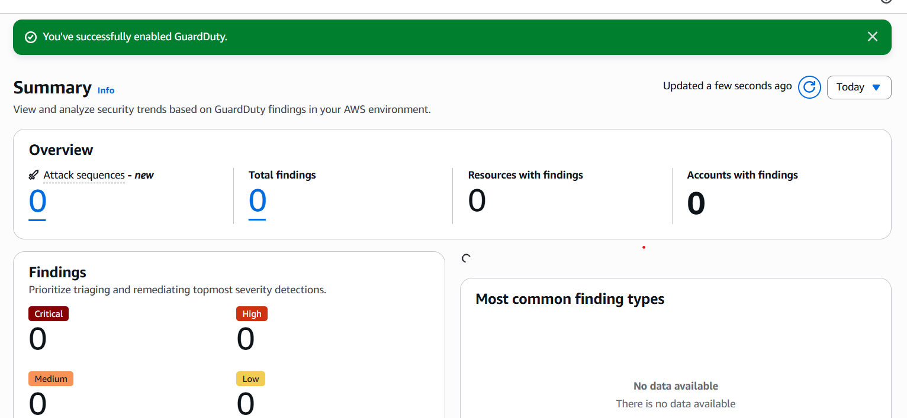

### Preparing Your Dev Environment and Simulate security threat

1. Reboot the `dev-server`

2. Install the network mapper tool (nmap)

```
[ec2-user@ip-172-31-30-163 ~]$ sudo yum install nmap -y
Last metadata expiration check: 5:46:54 ago on Fri May  1 21:40:17 2026.
Dependencies resolved.
================================================================================================================================================
 Package                        Architecture                Version                                      Repository                        Size
================================================================================================================================================
Installing:
 nmap                           x86_64                      3:7.93-4.amzn2023                            amazonlinux                      5.5 M
Installing dependencies:
 libssh2                        x86_64                      1.10.0-1.amzn2023.0.3                        amazonlinux                      120 k
 nmap-ncat                      x86_64                      3:7.93-4.amzn2023                            amazonlinux                      225 k

Transaction Summary
================================================================================================================================================
Install  3 Packages

Total download size: 5.9 M
Installed size: 25 M
Downloading Packages:
(1/3): nmap-ncat-7.93-4.amzn2023.x86_64.rpm                                                                     5.5 MB/s | 225 kB     00:00
(2/3): libssh2-1.10.0-1.amzn2023.0.3.x86_64.rpm                                                                 2.6 MB/s | 120 kB     00:00
(3/3): nmap-7.93-4.amzn2023.x86_64.rpm                                                                           37 MB/s | 5.5 MB     00:00
------------------------------------------------------------------------------------------------------------------------------------------------
Total                                                                                                            31 MB/s | 5.9 MB     00:00
Running transaction check
Transaction check succeeded.
Running transaction test
Transaction test succeeded.
Running transaction
  Preparing        :                                                                                                                        1/1
  Installing       : nmap-ncat-3:7.93-4.amzn2023.x86_64                                                                                     1/3
  Running scriptlet: nmap-ncat-3:7.93-4.amzn2023.x86_64                                                                                     1/3
  Installing       : libssh2-1.10.0-1.amzn2023.0.3.x86_64                                                                                   2/3
  Installing       : nmap-3:7.93-4.amzn2023.x86_64                                                                                          3/3
  Running scriptlet: nmap-3:7.93-4.amzn2023.x86_64                                                                                          3/3
  Verifying        : libssh2-1.10.0-1.amzn2023.0.3.x86_64                                                                                   1/3
  Verifying        : nmap-3:7.93-4.amzn2023.x86_64                                                                                          2/3
  Verifying        : nmap-ncat-3:7.93-4.amzn2023.x86_64                                                                                     3/3

Installed:
  libssh2-1.10.0-1.amzn2023.0.3.x86_64              nmap-3:7.93-4.amzn2023.x86_64              nmap-ncat-3:7.93-4.amzn2023.x86_64

Complete!
[ec2-user@ip-172-31-30-163 ~]$
```
3. From the `dev-server`, perform an aggressive port scan against `prod-server`

```
sudo nmap -Pn -p 1-1000 -T4 -A [prod-server-IP]
```
`Pn`: Skip host discovery and assume the target is online
`p 1-1000`: Scan ports 1-1000
`T4`: Use aggressive timing template (faster scan)
`A`: Enable OS detection, version detection, script scanning, and traceroute

```
[ec2-user@ip-172-31-30-163 ~]$ sudo nmap -Pn -p 1-1000 -T4 -A 16.176.32.92
Starting Nmap 7.93 ( https://nmap.org ) at 2026-05-02 03:28 UTC
```
This scan simulates a reconnaissance activity that an attacker might perform before attempting to exploit vulnerabilities.

4. Wait for GuardDuty to detect and report the security event. GuardDuty needs some time to analyze logs and identify patterns

[Complete output of `nmap` command]
```
[ec2-user@ip-172-31-30-163 ~]$ sudo nmap -Pn -p 1-1000 -T4 -A 16.176.32.92
Starting Nmap 7.93 ( https://nmap.org ) at 2026-05-02 03:28 UTC
Nmap scan report for ec2-16-176-32-92.ap-southeast-2.compute.amazonaws.com (16.176.32.92)
Host is up.
All 1000 scanned ports on ec2-16-176-32-92.ap-southeast-2.compute.amazonaws.com (16.176.32.92) are in ignored states.
Not shown: 1000 filtered tcp ports (no-response)
Too many fingerprints match this host to give specific OS details

TRACEROUTE (using proto 1/icmp)
HOP RTT     ADDRESS
1   0.85 ms 244.5.0.167
2   ... 30

OS and Service detection performed. Please report any incorrect results at https://nmap.org/submit/ .
Nmap done: 1 IP address (1 host up) scanned in 121.55 seconds
[ec2-user@ip-172-31-30-163 ~]$
```
5. Navigate to the GuardDuty console and click on "Findings" in the left navigation pane. This would list the security findings

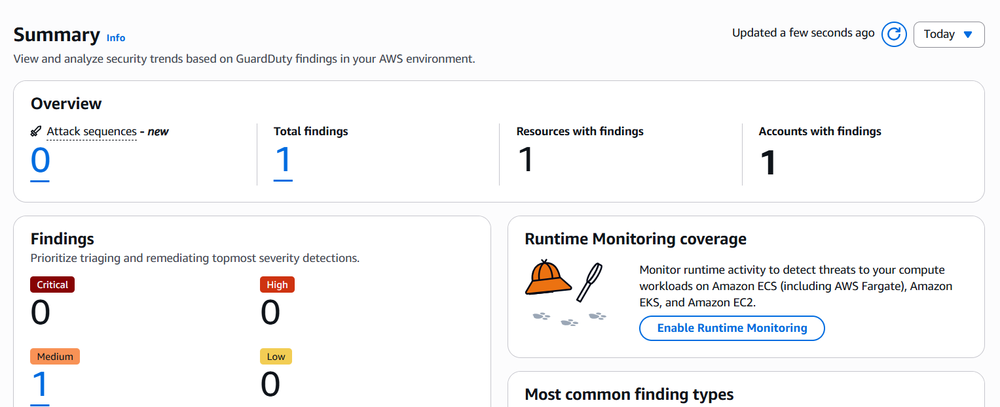
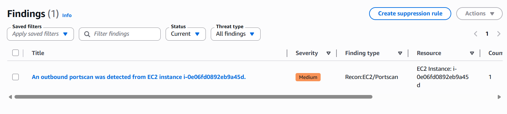
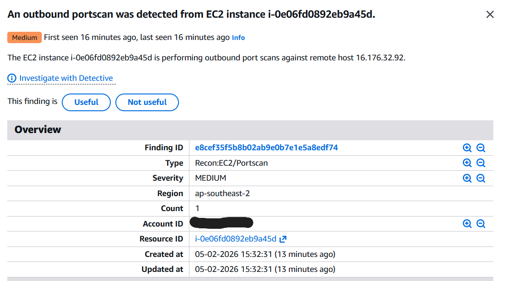

# Terraform Code

The terraform configuration for the project can be found at [terraform](./terraform)


    


